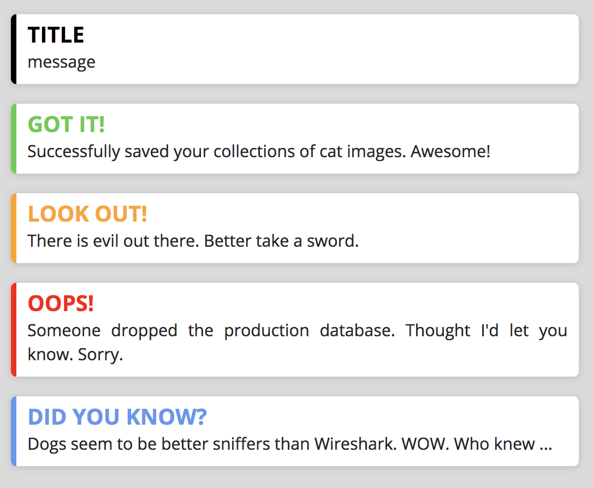

# What is this?
This is a web component designed by me, Michael. I want to build my own library of web components that I can use for my various projects.
I do not use a library for web components, just the standards that define those. Because of this those components do not work on all browser.
Actually, they only work in Chrome so far, and maybe Opera.

# Where can I use it?
As stated before, this component, and others from my components, do only work in Chrome and Opera. Other browsers do not support `HTML-Import` which is the way to import the component.
I might add support for other browsers once I find a solution that I think is sustainable. Currently even the guys developing the browsers are not sure what's the right way to-go.

# How do I use it?
You just download the repo and copy the `mibu-notification` folder into your project.
When you want to use the component just use it like this

```html
    <mibu-notification></mibu-notification>
```
This gives you a blank, black notification with placeholder text. Not much use for that.

If you want to change the color, or type, of the notification just give it a `type` attribute.

```html
    <mibu-notification type="success"></mibu-notification>
```
There are 5 different states the notification can have.
* `none`, this is the standard, use it by omitting the `type` attribute or by setting it to `none`
* `success`, this is a notification that signals that something finished successfully
* `warning`, use this type to indicate that something might become a problem in the future
* `failure`, use it when things go south, like an error
* `information`, use it to display random facts or hints in your application

Of course, the use-cases I described here are not set in stone, use them to your heart's desire, I don't judge you.

Now that you have set the correct type you can set the title of the notification and the message it displays. This can also be done easily through attributes, like so.

```html
    <mibu-notification type="success" title="YOUR TITLE HERE" message="Your message here ..."></mibu-notification>
```

One last thing, I`d love to know what my components are used for, so if you use them consider sending me a message with your creation in it.

# License
Copyright (c) 2018 Michael Burgstaller
Permission is hereby granted, free of charge, to any person obtaining a copy of this software and associated documentation files (the "Software"), to deal in the Software without restriction, including without limitation the rights to use, copy, modify, merge, publish, distribute, sublicense, and/or sell copies of the Software, and to permit persons to whom the Software is furnished to do so, subject to the following conditions:

The above copyright notice and this permission notice shall be included in all copies or substantial portions of the Software.

THE SOFTWARE IS PROVIDED "AS IS", WITHOUT WARRANTY OF ANY KIND, EXPRESS OR IMPLIED, INCLUDING BUT NOT LIMITED TO THE WARRANTIES OF MERCHANTABILITY, FITNESS FOR A PARTICULAR PURPOSE AND NONINFRINGEMENT. IN NO EVENT SHALL THE AUTHORS OR COPYRIGHT HOLDERS BE LIABLE FOR ANY CLAIM, DAMAGES OR OTHER LIABILITY, WHETHER IN AN ACTION OF CONTRACT, TORT OR OTHERWISE, ARISING FROM, OUT OF OR IN CONNECTION WITH THE SOFTWARE OR THE USE OR OTHER DEALINGS IN THE SOFTWARE.